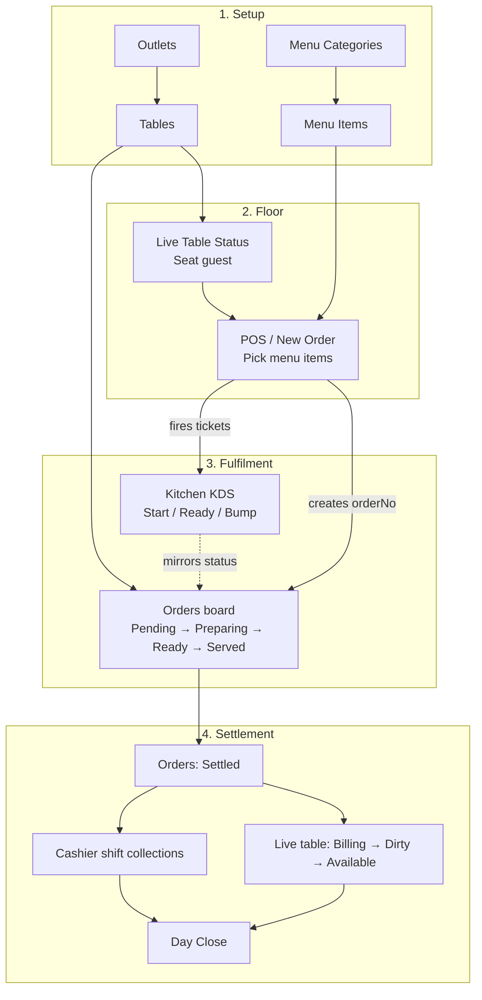
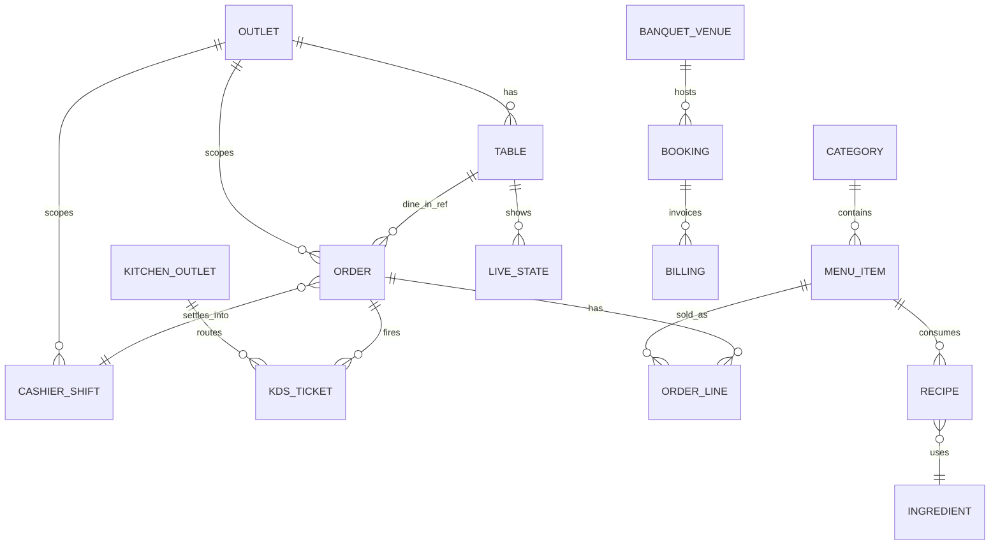

# Food & Beverages (F&B)

Documentation for the Hotel PMS **Food & Beverages** module: pages, data sources, how screens link through shared keys, and operational flows from menu setup to bill settlement.

---

## 1. Module overview

F&B covers restaurant / cafe outlets, banquet, kitchen, bar, inventory, POS, reports, and settings.

| Layer | Location | Role |
|-------|----------|------|
| Routes | `app/food-beverages/` | Next.js pages + catch-all |
| Navigation | `app/data/navigation/foodbeverages.ts` | Sidebar menu |
| List catalog data | `app/data/foodbeverages/modules.ts` | `fbPageDefinitions` for generic list pages |
| Ops / interactive data | `app/data/foodbeverages/ops.ts` | Live tables, orders, KDS, cashier |
| UI components | `components/foodbeverages/` | Dashboard + operator screens |
| Shared list kit | `components/pms/ModuleListPage.tsx` | Search / filter / drawer CRUD shell |

**Base URL:** `/food-beverages`

---

## 2. Routing model

```text
/food-beverages                     → redirect → /dashboard
/food-beverages/dashboard           → FbDashboardView  (custom)
/food-beverages/pos-billing         → PosBillingView   (FO reuse)
/food-beverages/restaurants/live-table-status → FbLiveTablesView (custom)
/food-beverages/restaurants/orders  → FbOrdersView     (custom)
/food-beverages/restaurants/cashier → FbCashierView    (custom)
/food-beverages/kitchen/kds         → FbKdsView        (custom)
/food-beverages/[...slug]           → FbCatchAllClient → FbModuleView → ModuleListPage
```

Dedicated operator pages **override** the catch-all. Everything else is driven by `fbPageDefinitions[path]` in `modules.ts`.

---

## 3. Shared linking keys (schema links)

All F&B entities hang off a small set of IDs / codes. This is how pages are meant to relate.

| Key | Meaning | Used by |
|-----|---------|---------|
| `outletId` | Restaurant / cafe / kitchen / bar scope | Tables, live tables, orders, cashier, reservations, most list rows |
| `tableNo` | Physical table code (`T-04`) | Tables master, live table status, dine-in orders (`ref`), KDS (`table`) |
| `orderNo` | Guest check / ticket (`ORD-501`) | Orders board, KDS tickets, kitchen orders, reports |
| `ticket` | Kitchen display id (`KDS-88`) | KDS only (maps back to `orderNo`) |
| Menu **category** name / id | Groups sellable items | Categories → Items (`category` field) |
| Menu **item** name | Sellable product | Items → Order lines → KDS lines → recipes / pricing |
| Banquet **booking** / **venue** id | Event scope | Venues → Bookings → Requirements → Billing → Close |
| Inventory **SKU** / ingredient | Stock identity | Ingredients → PO → GRN → movements → wastage / count |
| Cashier **shift** id | Shift collections | Cashier → cashier report → day close |

### Outlet master (scope root)

Defined in `modules.ts`:

- `restaurantOutlets` — `rest-1`, `rest-2`, `cafe-1`, `cafe-2`
- `banquetVenues` — halls / lawn / pool / rooftop
- `kitchenOutlets` — `main-kitchen`, `indian-kitchen`, …
- `barOutlets` — `main-bar`, `lobby-bar`

Almost every operational row carries `outletId` so the UI can filter by selected outlet.

---

## 4. Core schemas (interactive ops)

Source: `app/data/foodbeverages/ops.ts`

### LiveTable

```ts
{
  id, tableNo, section, capacity, covers,
  guest, server, durationMin, checkAmount,
  status: "Available" | "Reserved" | "Occupied" | "Billing" | "Dirty",
  outletId
}
```

**Links:** `outletId` → outlet · `tableNo` → Tables master & order `ref`

### FbOrder

```ts
{
  id, orderNo,
  type: "Dine In" | "Takeaway" | "Room Service" | "Online",
  ref,          // T-04 | Room 501 | Counter | Zomato
  guest, lines: [{ name, qty }], amount,
  status: "Pending" | "Preparing" | "Ready" | "Served" | "Settled",
  outletId, placedAt, server
}
```

**Links:** `outletId` · `ref` ↔ `tableNo` / room · `lines[].name` ↔ menu item name · `orderNo` ↔ KDS

### KdsTicket

```ts
{
  id, ticket, station, table, orderNo,
  lines: [{ name, qty, note? }],
  elapsedMin, slaMin,
  status: "Pending" | "Preparing" | "Ready" | "Bumped",
  outletId,     // kitchen outlet, not restaurant
  priority: "Normal" | "High"
}
```

**Links:** `orderNo` → `FbOrder.orderNo` · `table` → table / room / counter · kitchen `outletId`

### FbCashierShift

```ts
{
  id, cashier, shift, openedAt, openingFloat,
  cashSales, cardSales, upiSales, refunds,
  declaredCash, status: "Open" | "Closed" | "Pending",
  outletId
}
```

**Links:** `outletId` · sales totals conceptually sum of **Settled** orders for that shift

### Generic list page (`FbPageDefinition` in modules.ts)

```ts
{
  title, description, outletScope?,
  stats, columns, rows: FbRow[],
  searchPlaceholder, filterOptions?,
  actionLabel?, secondaryActions?, statusStyle?
}
```

Each `FbRow` typically has `id`, optional `status`, optional `outletId`, plus page-specific fields.

---

## 5. Page catalog

### A. Special / custom screens

| Route | Component | Data | Maturity |
|-------|-----------|------|----------|
| `/dashboard` | `FbDashboardView` | Local KPIs + links | Custom UI |
| `/restaurants/live-table-status` | `FbLiveTablesView` | `liveTablesSeed` | Interactive |
| `/restaurants/orders` | `FbOrdersView` | `fbOrdersSeed` | Interactive (board/list + detail) |
| `/restaurants/cashier` | `FbCashierView` | `fbCashierShiftsSeed` | Interactive |
| `/kitchen/kds` | `FbKdsView` | `kdsTicketsSeed` | Interactive |
| `/pos-billing` | FO `PosBillingView` | FO POS data | Interactive (shared) |

### B. Restaurants (mostly catch-all lists)

| Route | Purpose | Key fields / links |
|-------|---------|-------------------|
| `/restaurants/outlets` | Outlet master | `outletId` root |
| `/restaurants/tables` | Table master / QR | `tableNo` + `outletId` |
| `/restaurants/reservations` | Cover bookings | `tableNo`, guest, time → seats live table |
| `/restaurants/day-close` | EOD checklist | Depends on open tables, open shifts, settled sales |

### C. Menu

| Route | Purpose | Links |
|-------|---------|-------|
| `/menu/categories` | Category master | Parent of items |
| `/menu/items` | Sellable items | `category` → categories; name → order/KDS lines |
| `/menu/modifiers` | Add-ons | Attachable to items |
| `/menu/recipes` | Ingredient bill of materials | Item → ingredients (inventory) |
| `/menu/combos` | Bundles | References multiple items |
| `/menu/pricing` | Outlet / online prices | Item + `outletId` |

### D. Kitchen

| Route | Purpose | Links |
|-------|---------|-------|
| `/kitchen/kds` | Live cook screen | Custom — see ops |
| `/kitchen/orders` | All kitchen tickets | `orderNo` |
| `/kitchen/preparation-queue` | Timed prep sequence | Ticket / item |

### E. Banquet

| Route | Purpose | Links |
|-------|---------|-------|
| `/banquet/venues` | Halls / lawns | Venue id |
| `/banquet/bookings` | Events | Venue + date |
| `/banquet/menu-packages` | Event menus | Package → items/prices |
| `/banquet/requirements` | AV / seating / F&B setup | Booking |
| `/banquet/billing` | Event invoice | Booking |
| `/banquet/close-event` | Final settlement | Billing |

### F. Inventory & Bar

Inventory: ingredients → suppliers → PO → GRN → stock movement / wastage / count / adjustments.  
Bar mirrors menu+orders for drinks (`drink-categories` → `drinks` / `cocktails` → `bar/orders`).

### G. Reports & Settings

Reports aggregate sales / cashier / turnover / food cost (intended from settled orders + inventory).  
Settings: taxes, discounts, service charge, printers, order types, payment modes, etc. — config consumed by POS & settlement.

---

## 6. End-to-end operational flow (restaurant dine-in)

### Intended product flow



### Status machines

**Table**

```text
Available → Occupied → Billing → Dirty → Available
     ↑         ↑
  Reserved   (from reservation / seat)
```

**Order**

```text
Pending → Preparing → Ready → Served → Settled
```

**KDS ticket**

```text
Pending → Preparing → Ready → Bumped (off board)
```

### Data hand-offs (field level)

```text
Menu Item.name
    │
    ▼
FbOrder.lines[].name  ──orderNo──►  KdsTicket.orderNo + lines
    │
    ├── type=Dine In → ref = LiveTable.tableNo
    ├── Room Service → ref = Room ###
    └── Takeaway/Online → ref = Counter / channel
    │
    ▼ status = Settled
CashierShift.{cashSales,cardSales,upiSales}   (same outletId)
LiveTable.status → Billing → Dirty            (same tableNo)
```

---

## 7. Entity relationship (logical)



---

## 8. Alternate entry paths

| Path | Entry | Lands on | Settlement |
|------|-------|----------|------------|
| Dine-in | Live Tables → seat → order | Orders + KDS | Settled + Cashier + clear table |
| Walk-in / counter | POS Billing | Settled sale | Cashier |
| Room service | Order type Room Service | Orders + KDS | Settled (± post to FO folio later) |
| Online / takeaway | Order type Online / Takeaway | Orders + KDS | Settled + Cashier |
| Banquet | Bookings → packages → billing | Banquet Billing / Close Event | Event close |
| Bar | Bar menu → Bar Orders | Bar / kitchen parallel | Same cashier outlet or bar till |

---

## 9. Current wiring status (important)

This module is a **UI + mock-data prototype**. Screens share *schemas and IDs by convention*, but most are **not yet a live shared store**.

| Link | Today |
|------|--------|
| Categories → Items | Same list catalog; not a real FK store |
| Items → New Order POS | **Not wired** — Orders use `fbOrdersSeed` |
| Seat table → open order | Parallel mocks; seating does not create `ORD-*` |
| Orders ↔ KDS | Same `orderNo` in seed data; updates are **local React state** per page |
| Settled → Cashier sales | Conceptual only |
| Day close → blockers | List mock; not reading live open checks/shifts |

### What *is* interactive per page

- **Live Tables:** seat / bill / settle / clean (state in `FbLiveTablesView`)
- **Orders:** board ↔ list, detail drawer, status advance (state in `FbOrdersView`)
- **KDS:** Start / Ready / Bump (state in `FbKdsView`)
- **Cashier:** open / close shift, cash variance (state in `FbCashierView`)

To make the documented flow real, introduce a shared client store (or API) keyed by `outletId` / `orderNo` / `tableNo` and have these four screens subscribe to it.

---

## 10. File map

```text
app/food-beverages/
  README.md                 ← this doc
  layout.tsx                ← AppShell + F&B sidebar
  page.tsx                  ← redirect to dashboard
  dashboard/page.tsx
  pos-billing/page.tsx
  restaurants/
    live-table-status/page.tsx
    orders/page.tsx
    cashier/page.tsx
  kitchen/kds/page.tsx
  [...slug]/page.tsx         ← catch-all list pages

app/data/foodbeverages/
  modules.ts                ← outlets + fbPageDefinitions
  ops.ts                    ← LiveTable / FbOrder / KdsTicket / CashierShift
  index.ts

app/data/navigation/foodbeverages.ts

components/foodbeverages/
  FbDashboardView.tsx
  FbLiveTablesView.tsx
  FbOrdersView.tsx
  FbKdsView.tsx
  FbCashierView.tsx
  FbModuleView.tsx
  FbCatchAllClient.tsx
  FbOutletSelect.tsx
```

---

## 11. Quick “where does data go?” cheat sheet

| I just… | Next screen | Linking field |
|---------|-------------|---------------|
| Added a category | Menu → Items | category name |
| Added an item | POS / New Order *(planned)* | item name / id |
| Seated a table | Orders / POS | `tableNo` + `outletId` |
| Placed an order | Orders (Pending) + KDS | `orderNo` |
| Kitchen finished | Orders → Ready / Served | `orderNo` |
| Guest paid | Orders → Settled + Cashier | `outletId`, amount |
| Cleared table | Live Tables → Dirty → Available | `tableNo` |
| Closed the day | Day Close | open checks = 0, shifts closed |

---

## 12. Suggested next engineering step

1. Shared F&B session/store (e.g. `lib/fb-session.ts`) holding tables, orders, KDS tickets, shifts.  
2. POS “New Order” that writes `FbOrder` + `KdsTicket` rows from menu items.  
3. Subscribe Live Tables / Orders / KDS / Cashier to that store so settlement updates all three money/table paths.  
4. Keep catch-all list pages for masters until they need the same store.
